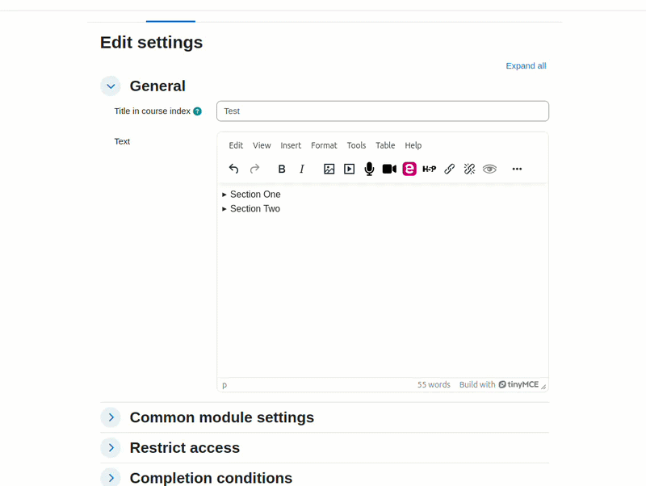

moodle-tiny_accordion
=====================

What is this
------------

This TinyMCE plugin for Moodle extends the editor's functionality by enabling users to create, edit, and manage accordion components directly within the content area. It provides an interface for inserting structured, collapsible sections, allowing content to be organised in a clear and user-friendly manner without requiring manual HTML editing

## Demo

Branches
------------

| Moodle version    | Branch             |
| ----------------- | ------------------ |
| Moodle 4.5  | `main` |

Installation
------------

Install the plugin the same way as any standard Moodle plugin (https://docs.moodle.org/405/en/Installing_plugins), either via the Moodle Plugin Directory or by cloning the repository into your Moodle source code:

    `git clone git@github.com:catalyst/moodle-tiny_accordion.git lib/editor/tiny/plugins/accordion`

References
------------

This plugin implementation is based on the following official documentation:

- **TinyMCE Accordion Documentation**  
  https://www.tiny.cloud/docs/tinymce/latest/accordion/

- **Moodle TinyMCE Plugin Development Documentation**  
  https://moodledev.io/docs/4.5/apis/plugintypes/tiny

## Support

If you have issues please log them in [GitHub](https://github.com/catalyst/moodle-tiny_accordion).

Please note our time is limited, so if you need urgent support or want to sponsor a new feature then please contact [Catalyst IT Australia](https://www.catalyst-au.net/).

Acknowledgements
================

Sponsored by
------------

Developed by
------------
